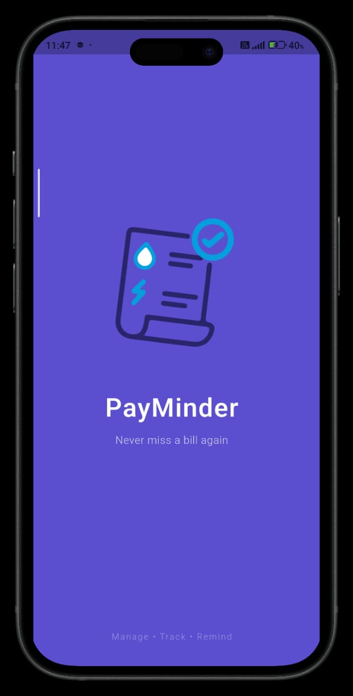
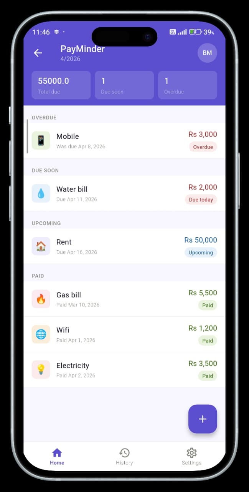
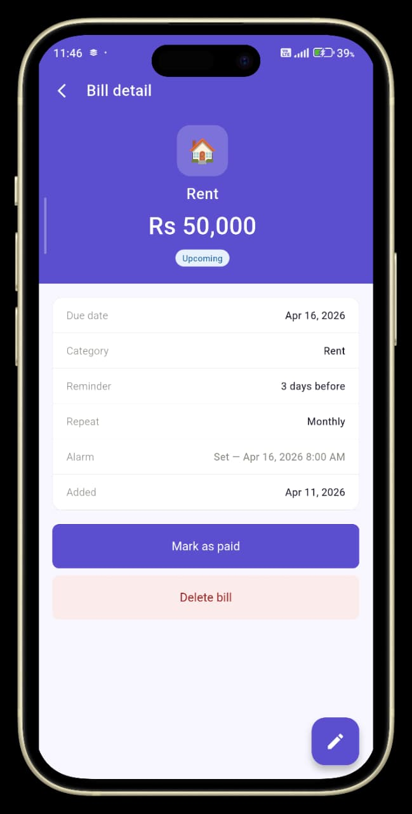
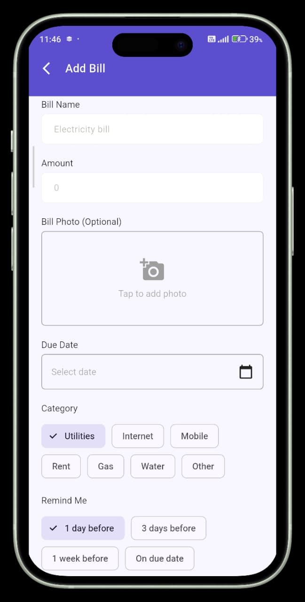
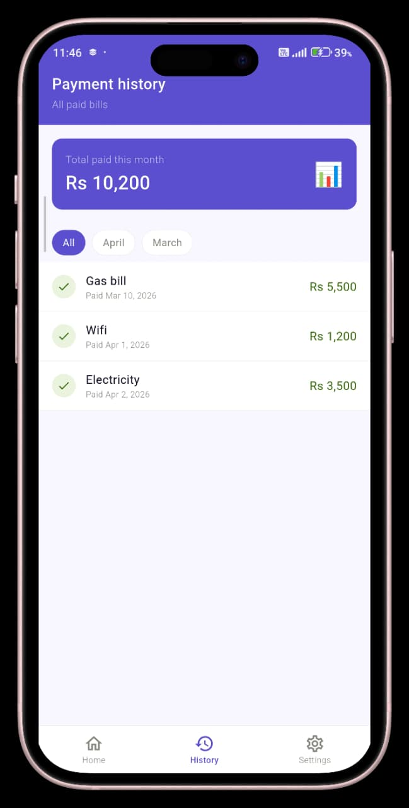
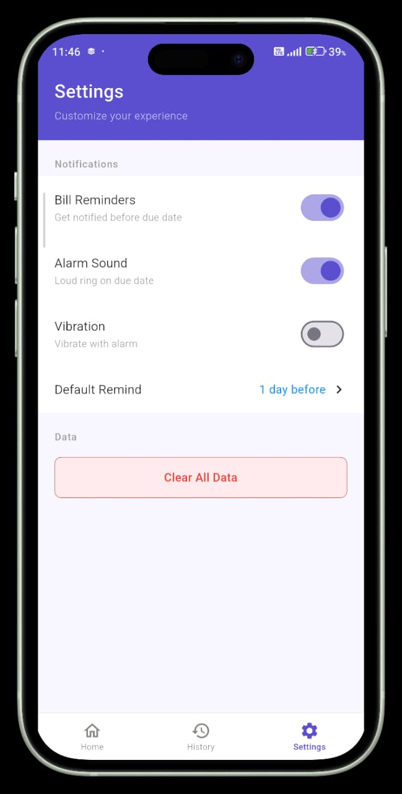

<h1 align="center">🚀 PayMinder – Bill Reminder App</h1>
<h3 align="center">A Smart Flutter App to Never Miss a Payment Again</h3>

<p align="center">
  
  
  
</p>

---

<h2>👨‍💻 About Me</h2>

<p>
Hi 👋, I'm <b>Hamza Maqbool</b><br>
A passionate <b>Flutter Developer</b> focused on building real-world mobile applications.
</p>

<ul>
  <li>🔭 Currently working on <b>Flutter Apps</b></li>
  <li>🌱 Learning <b>Advanced Flutter & Clean Architecture</b></li>
  <li>👯 Open to collaborate on <b>Flutter & Mobile Projects</b></li>
  <li>💬 Ask me about <b>Flutter, BLoC, Hive</b></li>
  <li>📫 Contact: <b>bilalmaqbool138@gmail.com</b></li>
</ul>

---

<h2>📱 Project Overview</h2>

<p>
<b>PayMinder</b> is a fully functional <b>Bill Reminder Mobile App</b> built using Flutter.  
It helps users track bills, set reminders, and avoid late payments with smart notifications.
</p>

---

<h2>✨ Key Features</h2>

<ul>
  <li>➕ Add, Edit, Delete Bills</li>
  <li>📅 Smart reminders (1 day, 3 days, 1 week before)</li>
  <li>🔔 Loud alarm on due date (even in silent mode)</li>
  <li>🔁 Repeat bills (Monthly & Yearly)</li>
  <li>📊 Categorized bills (Upcoming, Due Soon, Overdue, Paid)</li>
  <li>📜 Payment history tracking</li>
  <li>🌙 Dark Mode support</li>
  <li>⚙️ Settings (reminder time, alarm sound, vibration)</li>
</ul>

---

<h2>🧠 What I Learned</h2>

<ul>
  <li>🏗️ Clean Architecture (Core / Data / Domain / Presentation)</li>
  <li>🔄 State Management using <b>BLoC Pattern</b></li>
  <li>💾 Local Storage using <b>Hive</b></li>
  <li>⏰ Scheduling Notifications & Alarms</li>
  <li>🎯 Building production-level Flutter apps</li>
</ul>

---

<h2>🛠️ Tech Stack</h2>

<ul>
  <li><b>Flutter & Dart</b> – UI Development</li>
  <li><b>BLoC</b> – State Management</li>
  <li><b>Hive</b> – Local Database</li>
  <li><b>Flutter Local Notifications</b> – Reminders</li>
  <li><b>Alarm Package</b> – Loud Alarm</li>
  <li><b>Lottie</b> – Animations</li>
</ul>

---

<h2>📸 App Screenshots</h2>

<p align="center">
  
  
  
  
  
  
</p>

---

<h2>⚙️ Installation</h2>

```bash
# Clone the repository
git clone https://github.com/HamzaMaqbool-786/PayMinder.git

# Navigate to project
cd PayMinder

# Install dependencies
flutter pub get

# Run the app
flutter run
